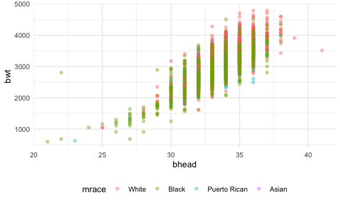
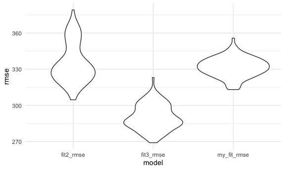

homework6
================

## Problem 1

Data clean

``` r
baby_birthweight_df=read.csv("data/birthweight.csv") %>% 
  select(-pnumlbw,-pnumsga) %>%
  mutate(babysex=as.factor(babysex),frace=as.factor(frace),mrace=as.factor(mrace),malform=as.factor(malform)) %>% 
  filter(!menarche<5) %>% 
  filter(!fincome<5) %>% 
  mutate(babysex=factor(babysex, levels = 1:2, labels = c("female", "male"))) %>%     mutate(mrace=factor(mrace,levels=1:5,labels=c("White","Black","Asian","Puerto Rican","Other"))) %>% 
  mutate(malform=factor(malform,levels = 0:1,labels=c("absent","present"))) %>% 
  mutate(frace=factor(frace,levels = 1:9,labels=c("White","Black","Asian","Puerto Rican","Other","","","Other","Unkown"))) %>% 
  mutate(mrace=fct_infreq(mrace)) %>% 
  select(babysex,bhead,blength,bwt,gaweeks,mrace)

colSums(is.na(baby_birthweight_df))
```

    ## babysex   bhead blength     bwt gaweeks   mrace 
    ##       0       0       0       0       0       0

``` r
baby_birthweight_df %>% skimr::skim_without_charts()
```

|                                                  |            |
|:-------------------------------------------------|:-----------|
| Name                                             | Piped data |
| Number of rows                                   | 4340       |
| Number of columns                                | 6          |
| \_\_\_\_\_\_\_\_\_\_\_\_\_\_\_\_\_\_\_\_\_\_\_   |            |
| Column type frequency:                           |            |
| factor                                           | 2          |
| numeric                                          | 4          |
| \_\_\_\_\_\_\_\_\_\_\_\_\_\_\_\_\_\_\_\_\_\_\_\_ |            |
| Group variables                                  | None       |

Data summary

**Variable type: factor**

| skim_variable | n_missing | complete_rate | ordered | n_unique | top_counts                              |
|:--------------|----------:|--------------:|:--------|---------:|:----------------------------------------|
| babysex       |         0 |             1 | FALSE   |        2 | fem: 2230, mal: 2110                    |
| mrace         |         0 |             1 | FALSE   |        4 | Whi: 2146, Bla: 1908, Pue: 243, Asi: 43 |

**Variable type: numeric**

| skim_variable | n_missing | complete_rate |    mean |     sd |    p0 |    p25 |    p50 |    p75 |   p100 |
|:--------------|----------:|--------------:|--------:|-------:|------:|-------:|-------:|-------:|-------:|
| bhead         |         0 |             1 |   33.65 |   1.62 |  21.0 |   33.0 |   34.0 |   35.0 |   41.0 |
| blength       |         0 |             1 |   49.75 |   2.72 |  20.0 |   48.0 |   50.0 |   51.0 |   63.0 |
| bwt           |         0 |             1 | 3114.70 | 512.09 | 595.0 | 2807.0 | 3147.0 | 3459.0 | 4791.0 |
| gaweeks       |         0 |             1 |   39.43 |   3.15 |  17.7 |   38.3 |   39.9 |   41.1 |   51.3 |

There is a sense that baby’s head circumference at birth is positively
correlated to baby’s birth weight and at the genetic level,mother’s race
plays a important role in baby’s birth weight.

``` r
baby_birthweight_df %>% 
  ggplot(aes(x=bhead,y=bwt,color=mrace)) + geom_point(alpha=0.4) 
```



``` r
baby_birthweight_df %>% 
  ggplot(aes(x=bhead,y=bwt)) + geom_point(alpha=0.4) + facet_wrap(.~mrace)
```


``` r
baby_birthweight_df %>% 
  ggplot(aes(x=mrace,y=bwt)) + geom_violin(alpha=0.4)
```


The plots above sort of align with the hypothesis that baby’s head
circumference at birth and mother’s race are two factors underlying
baby’s birthweight.

The model I propose is:

``` r
my_fit = lm(bwt ~ bhead  +  mrace,data=baby_birthweight_df )

broom::tidy(my_fit) %>% 
  select(term,estimate,p.value) %>% 
  mutate(term=str_replace(term,"mrace","Mother's race:")) %>% 
  knitr::kable()
```

| term                       |   estimate |   p.value |
|:---------------------------|-----------:|----------:|
| (Intercept)                | -4429.8354 | 0.0000000 |
| bhead                      |   226.5987 | 0.0000000 |
| Mother’s race:Black        |  -159.0869 | 0.0000000 |
| Mother’s race:Puerto Rican |  -173.4850 | 0.0000000 |
| Mother’s race:Asian        |  -113.2078 | 0.0265665 |

``` r
baby_birthweight_df %>% 
  modelr::add_residuals(my_fit) %>% 
  modelr::add_predictions(my_fit) %>% 
  select(bwt,bhead,mrace,resid,pred) %>% 
  ggplot(aes(x=pred,y=resid)) + geom_point(alpha=0.3) 
```


Two other models

``` r
fit2=lm(bwt~blength + gaweeks,data=baby_birthweight_df)
summary(fit2)
```

    ## 
    ## Call:
    ## lm(formula = bwt ~ blength + gaweeks, data = baby_birthweight_df)
    ## 
    ## Residuals:
    ##     Min      1Q  Median      3Q     Max 
    ## -1709.6  -215.4   -11.5   208.3  4188.7 
    ## 
    ## Coefficients:
    ##              Estimate Std. Error t value Pr(>|t|)    
    ## (Intercept) -4346.227     97.997  -44.35   <2e-16 ***
    ## blength       128.554      1.990   64.60   <2e-16 ***
    ## gaweeks        27.015      1.718   15.72   <2e-16 ***
    ## ---
    ## Signif. codes:  0 '***' 0.001 '**' 0.01 '*' 0.05 '.' 0.1 ' ' 1
    ## 
    ## Residual standard error: 333.2 on 4337 degrees of freedom
    ## Multiple R-squared:  0.5768, Adjusted R-squared:  0.5766 
    ## F-statistic:  2955 on 2 and 4337 DF,  p-value: < 2.2e-16

``` r
fit3=lm(bwt~bhead + blength + babysex + bhead*blength + bhead*babysex + blength*babysex + bhead*blength*babysex,data=baby_birthweight_df)
summary(fit3)
```

    ## 
    ## Call:
    ## lm(formula = bwt ~ bhead + blength + babysex + bhead * blength + 
    ##     bhead * babysex + blength * babysex + bhead * blength * babysex, 
    ##     data = baby_birthweight_df)
    ## 
    ## Residuals:
    ##      Min       1Q   Median       3Q      Max 
    ## -1133.31  -190.70    -9.79   178.46  2617.96 
    ## 
    ## Coefficients:
    ##                             Estimate Std. Error t value Pr(>|t|)    
    ## (Intercept)               -7176.8170  1264.6436  -5.675 1.48e-08 ***
    ## bhead                       181.7956    38.0483   4.778 1.83e-06 ***
    ## blength                     102.1269    26.2077   3.897 9.89e-05 ***
    ## babysexmale                6350.8140  1677.5698   3.786 0.000155 ***
    ## bhead:blength                -0.5536     0.7801  -0.710 0.477943    
    ## bhead:babysexmale          -197.5167    51.0870  -3.866 0.000112 ***
    ## blength:babysexmale        -123.2780    35.1142  -3.511 0.000451 ***
    ## bhead:blength:babysexmale     3.8603     1.0565   3.654 0.000261 ***
    ## ---
    ## Signif. codes:  0 '***' 0.001 '**' 0.01 '*' 0.05 '.' 0.1 ' ' 1
    ## 
    ## Residual standard error: 287.7 on 4332 degrees of freedom
    ## Multiple R-squared:  0.6849, Adjusted R-squared:  0.6844 
    ## F-statistic:  1345 on 7 and 4332 DF,  p-value: < 2.2e-16

Compare 3 models

``` r
cv_df=
  crossv_mc(baby_birthweight_df,100) %>% 
  mutate(
    train=map(train,as.tibble),
    test=map(test,as.tibble)
  ) %>% 
  mutate(my_fit = map(.x = train, ~lm(bwt ~ bhead + mrace, data = .x )),
    fit2 = map(.x = train,~lm(bwt~blength + gaweeks, data = .x)),
    fit3 = map(.x = train,~lm(bwt~bhead + blength + babysex + bhead*blength + bhead*babysex + blength*babysex + bhead*blength*babysex, data = .x))
  ) %>% 
  mutate(
    my_fit_rmse = map2_dbl(my_fit, test, ~rmse(model = .x, data = .y)),
    fit2_rmse = map2_dbl(fit2, test, ~rmse(model = .x, data = .y)),
    fit3_rmse = map2_dbl(fit3, test, ~rmse(model = .x, data = .y))
  ) %>%
  select(ends_with("rmse")) %>% 
  pivot_longer(
    everything(),names_to = "model",values_to = "rmse"
  ) %>% 
  ggplot(aes(model,rmse)) + geom_violin()
```

    ## Warning: `as.tibble()` was deprecated in tibble 2.0.0.
    ## Please use `as_tibble()` instead.
    ## The signature and semantics have changed, see `?as_tibble`.
    ## This warning is displayed once every 8 hours.
    ## Call `lifecycle::last_lifecycle_warnings()` to see where this warning was generated.

``` r
cv_df
```



According to the plot, the second model, which is third model(using head
circumference, length, sex, and all interactions (including the
three-way interaction) between these) has the best fitness.

## Problem 2

``` r
weather_df = 
  rnoaa::meteo_pull_monitors(
    c("USW00094728"),
    var = c("PRCP", "TMIN", "TMAX"), 
    date_min = "2017-01-01",
    date_max = "2017-12-31") %>%
  mutate(
    name = recode(id, USW00094728 = "CentralPark_NY"),
    tmin = tmin / 10,
    tmax = tmax / 10) %>%
  select(name, id, everything())
```

    ## Registered S3 method overwritten by 'hoardr':
    ##   method           from
    ##   print.cache_info httr

    ## using cached file: ~/Library/Caches/R/noaa_ghcnd/USW00094728.dly

    ## date created (size, mb): 2021-10-19 09:14:36 (7.606)

    ## file min/max dates: 1869-01-01 / 2021-10-31

``` r
set.seed(1)
boot_straps = 
  weather_df %>% 
  modelr::bootstrap(n = 5000) %>% 
  mutate(
    model = map(strap, ~lm(tmax~tmin, data = .x)),
    glance = map(model, broom::glance),
    results = map(model, broom::tidy)
  ) %>% 
  unnest(glance) %>% 
  select(.id, r.squared, results) %>% 
  unnest(results) %>%
  mutate(
    term=str_replace(term,"\\(Intercept\\)","Intercept")
  ) %>% 
  pivot_wider(
    names_from = term,
    values_from = estimate
  ) %>% 
 group_by(.id) %>% 
  summarise(intercept = max(Intercept, na.rm = TRUE),
            tmin = max(tmin, na.rm = TRUE),
            r.squared = mean(r.squared)) %>% 
  mutate(
    result = log(intercept*tmin)
  )
boot_straps %>% 
  ggplot(aes(x = r.squared)) + geom_density()+
  labs(title = 'distribution of r_squared')
```


``` r
boot_straps %>% 
  ggplot(aes(x = r.squared)) + geom_density()+
  labs(title = 'distribution of log(beta0*beta1)')
```


Both r_squared and log(beta0\*beta1) follows normal distribution, which
align with central limit theorem.

``` r
boot_straps %>% 
  summarize(
    r_squared_ci_lower = quantile(r.squared, 0.025), 
    r_squared_ci_upper = quantile(r.squared, 0.975),
    result_ci_lower = quantile(result, 0.025), 
    result_ci_upper = quantile(result, 0.975)) %>% 
  knitr::kable(caption = '95% CIs')
```

| r_squared_ci_lower | r_squared_ci_upper | result_ci_lower | result_ci_upper |
|-------------------:|-------------------:|----------------:|----------------:|
|          0.8936684 |           0.927106 |        1.964949 |        2.058887 |

95% CIs
